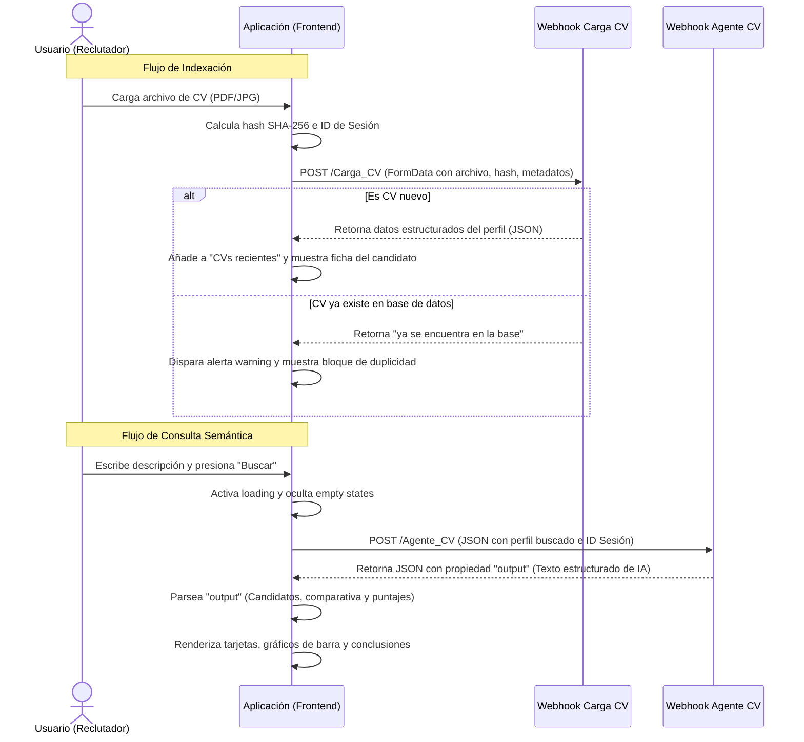

# Documento de Análisis Funcional
## Aplicación: Perfiles RRHH — Plataforma de Recursos Humanos con Inteligencia Artificial

---

### 1. Resumen Ejecutivo
**Perfiles RRHH** es una aplicación web monopágina (SPA) diseñada para optimizar los procesos de reclutamiento y selección de personal mediante el uso de inteligencia artificial. Su propósito principal es permitir a los reclutadores cargar currículums (CVs), procesarlos automáticamente para extraer información clave, e indexarlos en una base de datos para luego realizar búsquedas semánticas o basadas en perfiles específicos descritos en lenguaje natural.

La aplicación destaca por una interfaz moderna con estética oscura (*dark mode*), micro-animaciones fluidas, un sistema de alertas en tiempo real y soporte completo para la generación de reportes impresos o exportables a formato PDF.

---

### 2. Arquitectura de Integración (Webhooks)
La aplicación interactúa directamente con servicios backend externos a través de dos endpoints de integración (webhooks) principales:

1. **Webhook de Carga de CV**: 
   * **URL**: `https://prototipos.jpvidaldesign.com/webhook/Carga_CV`
   * **Método**: `POST`
   * **Payload**: `FormData` (Multipart/form-data) que incluye el archivo físico y metadatos adicionales de control.

2. **Webhook de Búsqueda de Perfiles**:
   * **URL**: `https://prototipos.jpvidaldesign.com/webhook/Agente_CV`
   * **Método**: `POST`
   * **Payload**: `JSON` que encapsula el texto libre de búsqueda y datos contextuales de la sesión.

---

### 3. Descripción Funcional detallada por Módulo

#### 3.1. Barra Superior (Topbar) y Encabezado General
* **Logotipo Dinámico**: Permite cambiar interactivamente la imagen de marca de la plataforma mediante un selector de archivos (`input[type="file"]`) que procesa la imagen a través de `FileReader` para actualizar instantáneamente el banner en el cliente sin requerir guardado persistente en el servidor.
* **Control de Reloj y Fecha (Live Clock)**: Muestra en tiempo real la fecha local en formato español (Día, Número de Día, Mes, Año), la hora (actualizada automáticamente cada minuto) y la Zona Horaria del cliente (obtenida dinámicamente mediante la API de internacionalización del navegador).

#### 3.2. Panel Lateral (Sidebar) — Gestión de Currículums
* **Zona de Carga (Drag & Drop / Selector)**: 
  * Permite subir archivos arrastrándolos o seleccionándolos desde el disco local.
  * **Formatos soportados**: PDF, JPG, JPEG y PNG (validado a nivel de cliente).
  * **Seguridad y Control de Duplicidad**: Para evitar subidas redundantes, la aplicación genera un hash criptográfico SHA-256 en el cliente utilizando la API `crypto.subtle.digest` antes de enviar el archivo.
  * **Envío de Metadatos**: El formulario incluye:
    * El archivo y su nombre.
    * Mimetype y tamaño del archivo.
    * Hash SHA-256 calculado (`file_hash`).
    * Fecha y hora en formato ISO con diferencia horaria calculada localmente (`submittedAt`).
    * Modo del formulario (`formMode` fijado en "test").
    * ID de Sesión (`session_id`) autogenerado para mantener el contexto.
* **Estado de la Carga**: Una barra de progreso simula visualmente la subida del documento mientras espera la respuesta del webhook, mostrando estados de "Cargando...", "Error al cargar" o "Procesado correctamente".
* **Lista de CVs Recientes**: Muestra un listado dinámico e interactivo de los archivos indexados durante la sesión actual con iconos de colores según su extensión (rojo para PDF, azul para Word/Docx, amarillo para imágenes).
* **Control de Duplicados**: Si la respuesta del webhook (`Carga_CV`) contiene el texto *"ya se encuentra"*, el sistema lo interpreta como un duplicado, bloquea el procesamiento normal, despliega una alerta de advertencia (*Warning*) y muestra una tarjeta especial informando que el CV ya está registrado.
* **Visualización de Datos Extraídos (Ficha del Candidato)**: Ante una carga exitosa, muestra los campos clave extraídos del currículum por la IA:
  * **Nombre** (e iniciales del avatar).
  * **Email**.
  * **Perfil Laboral**.
  * **Experiencia**.
  * **Habilidades**.
  * **Idiomas**.
  * **Educación**.
  * **Enlace al CV original** (ej. enlace a Google Drive/WebCVLink si está disponible en la respuesta, representado por un icono de documento).

#### 3.3. Sección Principal (Main Content) — Búsqueda Semántica
* **Búsqueda por Inteligencia Artificial**:
  * El reclutador ingresa en lenguaje natural la descripción del perfil buscado (ej: *"Busco desarrollador front-end con React y 3 años de experiencia..."*).
  * Soporta el comando de envío rápido `Ctrl + Enter` desde el cuadro de texto.
  * Al presionar "Buscar", el sistema invoca al webhook de `Agente_CV` enviando el texto de la búsqueda, el timestamp del sistema y el identificador de sesión.
* **Estados de la Interfaz**:
  * **Empty State**: Estado inicial con sugerencias de uso y llamada a la acción clara.
  * **Loading State**: Animación de tres puntos pulsantes mientras el Agente IA ejecuta la búsqueda semántica e interpreta la base de CVs.
  * **Results Content**: Despliegue de los hallazgos en componentes específicos.

#### 3.4. Motor de Renderizado e Interpretación de Resultados (Parser)
El Agente de IA devuelve la información en un bloque estructurado de texto (en la propiedad `output`). El cliente analiza este texto mediante expresiones regulares (Regex) y segmentación por líneas para construir dinámicamente tres secciones interactivas:
1. **Grilla de Candidatos Recomendados**:
   * Genera tarjetas individuales para cada perfil sugerido por la IA.
   * Muestra el avatar con iniciales, nombre, rol profesional asignado por el algoritmo, puntaje de compatibilidad general y puntos clave de su currículum.
   * Incluye el botón directo al archivo del currículum original (`WebCVLink`).
2. **Gráficos de Calificación Comparativa**:
   * Extrae los puntajes cuantitativos (ej. `9/10`, `8.5/10`) asociados a cada candidato.
   * Renderiza barras de progreso visuales con gradiente cromático (del azul al amarillo) correspondientes a cada puntaje obtenido.
3. **Sección de Comparación de Perfiles**:
   * Filtra y presenta las conclusiones comparativas directas generadas por la IA para guiar la toma de decisiones del reclutador.
* **Mecanismo de Respaldo (*Fallback*)**: Si la respuesta de la IA no se adecúa al patrón estructurado estándar, el sistema tiene la robustez de mostrar la respuesta de texto plano directamente en un bloque sin romper la interfaz de usuario.

#### 3.5. Sistema de Reportes (Impresión y Exportación a PDF)
* Incluye un botón para disparar la impresión nativa del sistema (`window.print()`).
* Implementa una hoja de estilos para impresión (`@page` y `@media print`) que automáticamente optimiza el reporte:
  * Oculta controles de UI irrelevantes (barra superior, barra lateral de carga, inputs, botones de búsqueda).
  * Cambia el diseño al tema claro con fondo blanco y tipografía de alto contraste en negro para optimizar el gasto de tinta y la legibilidad en papel.
  * Añade un encabezado exclusivo para la versión impresa detallando la consulta exacta de búsqueda, la fecha y hora de emisión del reporte local y la cantidad de perfiles presentados en el informe.
  * Evita la fragmentación de tarjetas de candidatos entre páginas mediante reglas de salto (`break-inside: avoid`).

---

### 4. Aspectos Técnicos y No Funcionales

#### 4.1. Diseño Visual y UX
* **Esquema de Colores**: Paleta sofisticada y oscura basada en variables CSS (`:root`), utilizando tonos Navy (`#0F1A2E`, `#162035`) y detalles neón en Azul (`#2563EB`) para acciones primarias, Verde (`#10B981`) para éxitos y cargas, y Ámbar (`#F59E0B`) para puntuaciones y alertas.
* **Tipografías**: Uso de *Syne* para títulos y números de impacto, y *DM Sans* para textos descriptivos y de lectura fluida. Ambos importados desde Google Fonts.
* **Interactividad y Micro-animaciones**:
  * Efectos `hover` de escala y brillo en tarjetas y botones.
  * Transiciones con curvas bezier personalizadas para lograr fluidez táctil.
  * Mensajes de alerta temporales de tipo Toast que entran y salen de la pantalla con animaciones de deslizamiento (`slideIn` / `slideOut`).
  * Estructuras adaptables y responsivas específicas para smartphones, tabletas y computadoras de escritorio.

#### 4.2. Variables de Control de Estado de Sesión y Tiempos
* **Identificación de Sesión**: Generación única al iniciar mediante `crypto.randomUUID()` guardado en el almacenamiento temporal de sesión (`sessionStorage`). Esto permite trazar el comportamiento de la navegación e identificar las interacciones de un mismo reclutador en los flujos de carga y búsqueda.
* **Formato de Fechas estandarizado**: Envío consistente de fechas con huso horario local mediante la función `isoWithOffset()` que corrige la desviación UTC.

#### 4.3. Flujo Lógico de Carga y Búsqueda (Diagrama de Secuencia)

